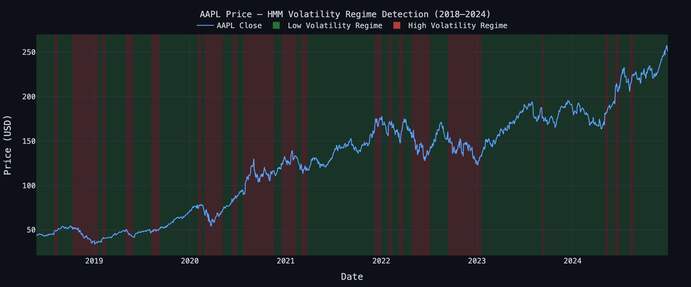
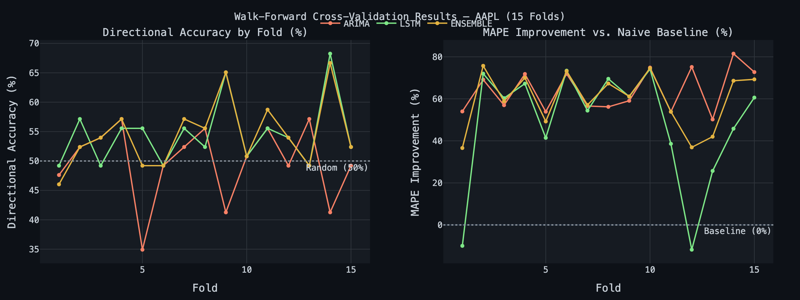
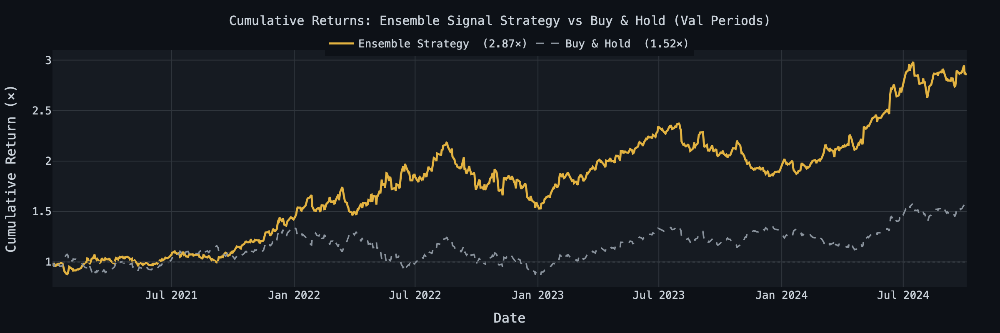

# Market Signal Forecaster

End-to-end market trend forecasting and signal modeling pipeline built with Python. Detects volatility regimes, engineers 24+ statistical features, and generates buy/sell signals via ARIMA/GARCH and LSTM models — all surfaced through an interactive Plotly Dash dashboard.

## Results (AAPL 2018–2024, 15-fold Walk-Forward CV)

| Model | Directional Accuracy | MAPE Improvement vs Baseline | IC |
|---|---|---|---|
| Ensemble | 54.5% | 59.6% | +0.04 |
| LSTM | 54.6% | 48.2% | +0.07 |
| ARIMA | 49.8% | 63.9% | -0.06 |

### Volatility Regime Detection
HMM-detected low-volatility (green) and high-volatility (red) regimes overlaid on AAPL price.



### Walk-Forward Validation Metrics
Directional accuracy and MAPE improvement across all 15 out-of-sample folds.



### Cumulative Returns: Ensemble Strategy vs Buy & Hold
Signal-driven long/short strategy (**2.07×**) vs. buy-and-hold (**1.52×**) over the validation periods.



---

## Architecture

```
yfinance API
    │
    ▼
┌─────────────────┐
│  Data Pipeline  │  fetch_data.py → cleaner.py → parquet cache
└────────┬────────┘
         │
         ▼
┌─────────────────────────────────────────────────────┐
│              Feature Engineering (24+ features)     │
│  returns.py · volatility.py · technical.py          │
│  statistical.py                                      │
│                                                      │
│  Returns: log_return, rolling_return_5/20d, ...      │
│  Volatility: realized_vol, Parkinson, GARCH, ...     │
│  Technical: RSI, MACD, Bollinger, ATR, Stochastic    │
│  Statistical: Hurst, entropy, autocorr, skew, ...    │
└────────────────────┬────────────────────────────────┘
                     │
         ┌───────────┴───────────┐
         ▼                       ▼
┌────────────────┐     ┌─────────────────────┐
│  ARIMA/GARCH   │     │    LSTM Forecaster   │
│  per regime    │     │  (128→64→Dense)      │
│  (HMM labels)  │     │  Huber loss          │
└───────┬────────┘     └──────────┬──────────┘
        └─────────────┬───────────┘
                      ▼
             ┌─────────────────┐
             │    Ensemble     │
             │  Signal Output  │
             └────────┬────────┘
                      │
                      ▼
         ┌────────────────────────┐
         │  Walk-Forward CV       │
         │  Expanding window      │
         │  RMSE · MAPE · IC · DA │
         └────────────────────────┘
                      │
                      ▼
         ┌────────────────────────┐
         │   Plotly Dash          │
         │   Dashboard            │
         │  · Market Overview     │
         │  · Model Performance   │
         │  · Signal View + P&L   │
         └────────────────────────┘
```

## Features Engineered (24+)

| Category | Features |
|---|---|
| Returns (6) | log_return, rolling_return_5d/20d, price_to_sma20, high_low_range, overnight_gap |
| Volatility (5) | realized_vol_10d/30d, parkinson_vol, vol_of_vol, garch_conditional_vol |
| Technical (5) | rsi_14, macd_histogram, bb_pct_b, atr_14, stochastic_k |
| Statistical (8) | autocorr_lag1/5, skewness_20d, kurtosis_20d, hurst_exponent, sample_entropy, rolling_sharpe_20d, z_score_return |

## Models

**ARIMA + GARCH (regime-aware)**
- Gaussian HMM (`hmmlearn`) detects 2 volatility regimes: low-vol and high-vol
- Separate `auto_arima` (pmdarima) fits per regime with AIC-based (p,d,q) selection
- Engle's ARCH-LM test automatically wraps residuals in GARCH(1,1) when volatility clustering is detected

**LSTM Forecaster**
- Architecture: `LSTM(128) → LSTM(64) → Dense(32) → Dense(1)`
- Regime label concatenated as input feature (regime-conditioned forecasting)
- Huber loss with Adam optimizer + gradient clipping (`clipnorm=1.0`)
- Early stopping + ReduceLROnPlateau callbacks

**Ensemble**
- Equal-weighted blend of ARIMA directional forecast and LSTM price forecast

## Validation

Walk-forward cross-validation (expanding window, no data leakage):
- Initial training window: 2 years (504 trading days)
- Re-fit every 21 days (monthly)
- 3-month out-of-sample validation windows

Metrics: RMSE · MAPE · Directional Accuracy · IC (Spearman) · ICIR · Annualized Sharpe · MAPE improvement vs. naive persistence baseline

## Setup

```bash
git clone https://github.com/<your-username>/market-signal-forecaster.git
cd market-signal-forecaster
pip install -r requirements.txt
```

## Usage

```bash
# 1. Download data and build features (AAPL, MSFT, SPY, QQQ by default)
python main.py pipeline

# 2. Run walk-forward cross-validation on a ticker
python main.py validate AAPL

# 3. Launch the interactive dashboard
python main.py dashboard
# → open http://localhost:8050

# Or run everything in sequence
python main.py all AAPL
```

## Running Tests

```bash
pytest tests/ -v
```

24 tests covering:
- Feature value correctness (RSI bounds, log return formula, 24+ feature count)
- Walk-forward splitter leakage guarantees (8 tests)

## Configuration

All parameters live in `config/config.yaml`:
- Tickers, date range
- Model hyperparameters (LSTM units, dropout, ARIMA bounds)
- Walk-forward CV settings
- Signal thresholds

## Tech Stack

Python · pandas · numpy · yfinance · statsmodels · pmdarima · arch · hmmlearn · TensorFlow/Keras · scikit-learn · ta · antropy · plotly · Dash · Flask-Caching
